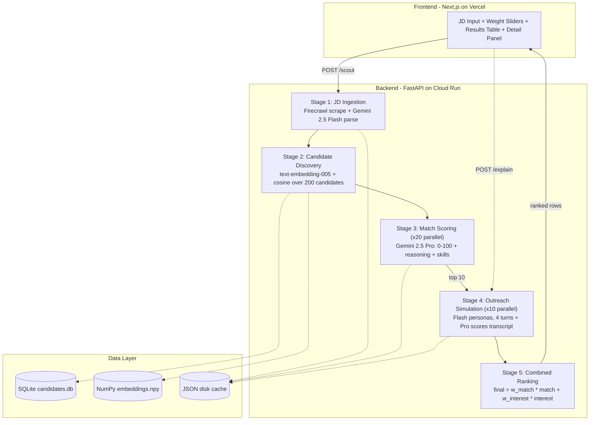

# AI-Powered Talent Scouting & Engagement Agent

Hackathon submission — **Catalyst, April 2026**.

**Live demo:** <https://frontend-beta-ten-81.vercel.app>
**Backend:** <https://scout-backend-agah7k3aja-uc.a.run.app/docs>
**Demo video:** <https://www.loom.com/share/5a628c6c5ccf4d118203e1b13622d274>

## Problem

Recruiters spend hours sifting profiles and chasing candidate interest. This agent takes a job description, finds matching candidates from your candidate pool, simulates outreach to assess genuine interest, and outputs a ranked shortlist scored on **Match** and **Interest**.

## How it works

The pipeline runs five stages:

1. **JD Ingestion** — text or URL (Firecrawl scrape) → Gemini 2.5 Flash parses to structured JSON
2. **Candidate Discovery** — JD embedded with `text-embedding-005`, cosine similarity over a 200-candidate pool, top 20 retrieved
3. **Match Scoring (with explainability)** — Gemini 2.5 Pro scores each retrieved candidate 0-100 with reasoning, matched skills, and missing skills. All 20 calls run in parallel.
4. **Simulated Outreach** — for the top 10, the agent runs a 4-turn recruiter↔candidate conversation. The candidate is roleplayed by Gemini 2.5 Flash with a hidden interest profile (`actively_looking | passive | not_looking`). All 10 conversations run in parallel; total wall-clock ≈ 15-60s (cached: <5s).
5. **Combined Ranking** — `final_score = w_match * match_score + w_interest * interest_score`. Defaults 0.6 / 0.4, retunable live via UI sliders.

## Architecture diagram



<details>
<summary>ASCII version (fallback)</summary>

```
┌─────────────────────────────────────────────────────────────────────────┐
│                        FRONTEND  (Next.js / Vercel)                    │
│  ┌──────────┐  ┌──────────────┐  ┌──────────────┐  ┌───────────────┐  │
│  │ JD Input │→ │ Results Table │→ │ Detail Panel │→ │ Weight Slider │  │
│  │ text/URL │  │  ranked list  │  │ match + chat │  │  live rerank  │  │
│  └──────────┘  └──────────────┘  └──────────────┘  └───────────────┘  │
└───────┬─────────────────────────────────────────────────────┬──────────┘
        │  POST /scout                                        │ POST /explain
        ▼                                                     ▼
┌─────────────────────────── BACKEND (FastAPI / Cloud Run) ──────────────┐
│                                                                        │
│  Stage 1: JD Ingestion                                                 │
│  ┌─────────────┐    ┌───────────────────┐                              │
│  │  Firecrawl   │──→│  Gemini 2.5 Flash  │──→ JDStruct (JSON)          │
│  │  (URL scrape)│    │  (parse to schema) │                             │
│  └─────────────┘    └───────────────────┘                              │
│                              │                                         │
│  Stage 2: Candidate Discovery│                                         │
│  ┌───────────────────┐       ▼                                         │
│  │ text-embedding-005 │  cosine similarity over 200-candidate pool     │
│  │ (embed JD)         │──→ top 20 retrieved                            │
│  └───────────────────┘                                                 │
│                              │                                         │
│  Stage 3: Match Scoring      ▼         ×20 parallel                    │
│  ┌───────────────────┐                                                 │
│  │  Gemini 2.5 Pro    │──→ score 0-100 + reasoning + skills            │
│  │  (with rubric)     │                                                │
│  └───────────────────┘                                                 │
│                              │                                         │
│  Stage 4: Outreach Sim       ▼         ×10 parallel (top 10)           │
│  ┌───────────────────┐  ┌───────────────────┐                          │
│  │  Gemini 2.5 Flash  │⇄│  Gemini 2.5 Flash  │  4-turn conversation   │
│  │  (recruiter agent) │  │ (candidate agent)  │  + interest scoring    │
│  └───────────────────┘  └───────────────────┘                          │
│                              │                                         │
│  Stage 5: Ranking            ▼                                         │
│  ┌──────────────────────────────────────────┐                          │
│  │  final = w_match × match + w_interest × interest                    │
│  │  weights tunable from frontend (default 0.6/0.4)                    │
│  └──────────────────────────────────────────┘                          │
│                                                                        │
│  ┌─────────┐  ┌─────────┐  ┌──────────┐                               │
│  │ SQLite  │  │  .npy   │  │ JSON     │   ← persistent storage        │
│  │(profiles)│  │(vectors)│  │(cache)   │                               │
│  └─────────┘  └─────────┘  └──────────┘                               │
└────────────────────────────────────────────────────────────────────────┘
```

</details>

Mermaid source also lives at [`docs/architecture.mmd`](docs/architecture.mmd) for editing.

## Scoring details

- **Match Score (0-100):** explicit prompt anchors — 90+ exceptional, 70-89 strong, 50-69 plausible-with-gaps, <50 misalignment. Reasoning cites concrete skill matches and gaps.
- **Interest Score (0-100):** scored from the conversation transcript by a separate Gemini 2.5 Pro call. 80+ engaged, 50-79 open with blockers, 20-49 polite-but-uninterested, <20 clear no.
- **Explain this conversation** button surfaces the LLM's quoted-evidence rationale for any candidate.

## Quickstart (local)

```bash
# Backend
cd backend
python -m venv .venv && .venv\Scripts\activate     # Windows
pip install -r requirements.txt
cp .env.example .env       # fill GCP project, Anthropic key, Firecrawl key
python -m seed.generate_pool        # one-time: generate 200 candidates (~5 min, Claude Opus)
python -m seed.embed_pool           # one-time: pre-compute embeddings (~30s)
uvicorn app.main:app --port 8000

# Frontend (separate terminal)
cd frontend
cp .env.local.example .env.local    # NEXT_PUBLIC_BACKEND_URL=http://localhost:8000
npm install
npm run dev
```

Open <http://localhost:3000>.

## Sample inputs / outputs

Three canned JDs live in [`backend/tests/fixtures/sample_jds.json`](backend/tests/fixtures/sample_jds.json):

- **Backend Engineer (fintech, Bengaluru)** — top result: match≈96, interest≈65, final≈83.6
- **ML Engineer (LLM apps, remote)** — top result: match≈90+, interest≈70+
- **Senior Product Designer (B2B SaaS)** — top result: match≈85+, interest≈65+

(Exact names vary per run — candidate pool is regenerated by the seed script.)

## Tech stack

| Layer | Choice |
|---|---|
| Frontend | Next.js 14 (App Router), TypeScript, Tailwind CSS v3, shadcn/ui — deploy on Vercel |
| Backend | FastAPI (Python 3.11), uvicorn — deployed on Cloud Run |
| LLMs | Gemini 2.5 Flash + Gemini 2.5 Pro on Vertex AI |
| Embeddings | Vertex `text-embedding-005`, L2-normalized NumPy matrix |
| Scraping | Firecrawl `/scrape` (markdown) |
| Storage | SQLite (candidates), `.npy` (embeddings), JSON disk cache |
| Pool generation | Claude Opus 4.7 (one-shot, audit JSON committed) |

## Repo layout

```
backend/   FastAPI app, pipeline modules, seed scripts, tests
frontend/  Next.js UI
docs/      specs and plans
```

## Demo script (3 min)

1. **0:00–0:30** — Paste a JD URL → show Firecrawl fetch + Gemini parse (JD struct appears)
2. **0:30–1:00** — 20 candidates matched appear with match scores and reasoning
3. **1:00–1:45** — 10 simulated conversations stream in, interest scores populate
4. **1:45–2:15** — Show ranked table; click a row to open conversation drawer
5. **2:15–2:30** — Move weight slider; ranking re-sorts live without re-running pipeline
6. **2:30–2:50** — Click "Explain this conversation" on a passive candidate
7. **2:50–3:00** — One-line architecture recap + close

## Production swap-ins

The candidate-source layer is pluggable. To plug in a real source:

- Replace `backend/seed/generate_pool.py` with a script pulling from your ATS / LinkedIn API / GitHub API
- Re-run `python -m seed.embed_pool` to refresh the embeddings matrix
- Everything downstream (retrieval, match scoring, outreach, ranking) is data-source agnostic

## License

MIT
